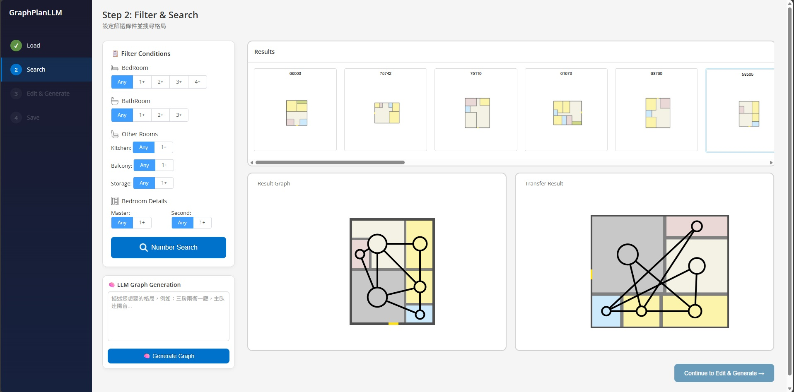

# GraphPlan_LLM

An AI-driven interactive interface for floorplan generation. **GraphPlan_LLM** enhances the original Graph2plan by integrating Large Language Models (LLMs) to allow users to generate floorplans using natural language descriptions.

#### Project Features
- **LLM-Powered Planning**: Convert natural language (e.g., "3 bedrooms, 2 bathrooms") to structured layout graphs via Groq API.
- **Interactive Refinement**: Fine-tune AI-generated layouts using the interactive web interface.
- **End-to-End Generation**: From text to topology, and finally to a fully realized raster and vector floorplan.



---

## 🚀 Quick Start (Installation)

> [!NOTE]
> **Environment Update**: The current version has been fully transitioned to **Python**. **MATLAB is NO LONGER REQUIRED** for room alignment or post-processing.

### 1. Requirements
* **OS**: Tested on Windows 10 / WSL (Ubuntu)
* **Python**: 3.7 or 3.9 (Recommended)
* **Isolation**: Always use a Python virtual environment (`venv`) to isolate project dependencies from the system environment and avoid version conflicts.

### 2. Setup Environment
```bash
# Create and activate a venv (isolated from system)
python -m venv GraphPlan_venv
source GraphPlan_venv/bin/activate

# Install PyTorch (Update CUDA version based on your GPU)
pip install torch torchvision torchaudio --index-url https://download.pytorch.org/whl/cu117 -U

# Install Dependencies (Django, OpenCV, Shapely, etc.)
pip install django opencv-python scipy pandas shapely tqdm tensorboardX pytorch-ignite==0.2.1 -U
# LLM Integration (Optional/New Features)
pip install langchain langchain-openai python-dotenv
```

### 3. Data Preparation
1.  Download pre-processed data: [Data.zip](https://github.com/HanHan55/Graph2plan/releases/download/data/Data.zip)
2.  Unzip the data into the repository root.
3.  Ensure the structure matches: `Interface/static/Data/Img/` for boundary images.

---

## 🛠️ Usage

### Running the Web Interface
Navigate to the `Interface` directory and start the Django server:
```bash
cd Interface
python manage.py runserver 0.0.0.0:8000
```
Open your browser at: `http://127.0.0.1:8000/home`

### Running Network & Training
Training logic is located in the `Network/` folder.
```bash
cd Network
python train.py
```

### Post-Processing (Without MATLAB)
The post-processing logic now uses `align_fp_python`. You can run tests via:
```bash
cd PostProcess
python test_interface_data.py
```

---

## 📝 專案說明 (繁體中文)

### 環境需求
本專案目前僅需 Python 即可運行。強烈建議使用虛擬環境 (`venv`) 執行，以確保專案依賴不會影響系統端的 Python 設置。

### 安裝步驟
1. 建立 Python 3.9 虛擬環境（實現環境隔離）：
   ```bash
   python -m venv GraphPlan_venv
   source GraphPlan_venv/bin/activate
   ```
2. 依照上述指令安裝 `PyTorch` 與 `Django` 相關套件。
3. 解壓縮預處理資料包。

### 執行
進入 `Interface` 目錄並執行 `python manage.py runserver` 即可啟動網頁介面。

---

## 📄 License

This project is licensed under the **GNU General Public License v3.0 (GPLv3)**. See the [LICENSE](LICENSE) file for details.

## Acknowledgement
* sg2im: https://github.com/google/sg2im
* scene generation: https://github.com/ashual/scene_generation
* RPLAN Dataset: http://staff.ustc.edu.cn/~fuxm/projects/DeepLayout/index.html (Unavailable now)
